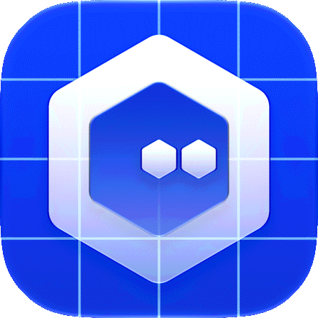

<h1>
  
  &nbsp;mikrokhoros
</h1>

[](https://github.com/sonatapublisher/mikrokhoros/actions/workflows/ci.yml)
[](https://www.swift.org/)
[](#platforms)
[](LICENSE)

**An open source AI agent harness for object-first worlds.**

*mikrokhoros* combines Ancient Greek *mikrós* (“small”) and *khōros* (“place”): a
small, concrete place for agents and objects.

## Public facts

Open source AI agent harness for object-first worlds. Every persistent capability an agent can inspect or invoke is a concrete object with identity, state, location, authority, and history; bounded actions produce runtime-verified consequences and replayable trajectories.

- Public name and slug: `mikrokhoros`
- Executable: `khoros`
- License: [Apache-2.0](https://www.apache.org/licenses/LICENSE-2.0)
- Lifecycle: pre-release; no stable release is published.
- Repository: [github.com/sonatapublisher/mikrokhoros](https://github.com/sonatapublisher/mikrokhoros)
- Homepage: [mikrokhoros.org](https://mikrokhoros.org/)
- Machine-readable contract: [`docs/public-facts.json`](docs/public-facts.json)

Allowed public actions: [View source](https://github.com/sonatapublisher/mikrokhoros),
[Read the docs](https://github.com/sonatapublisher/mikrokhoros/tree/main/docs),
[Install khoros](https://github.com/sonatapublisher/mikrokhoros#install-khoros),
or [Open mikrokhoros Web](https://github.com/sonatapublisher/mikrokhoros#open-mikrokhoros-web).

## Start a local world

From a checkout on macOS or Linux with Swift 6.1+:

```bash
make install
export PATH="$HOME/.local/bin:$PATH"
khoros init
khoros web
```

`khoros init` creates the complete `default-khoros` setup and one unprofiled
agent without external model configuration. `khoros web` prints the exact local
URL for the native browser interface. Windows setup is covered in the
[installation instructions](#install-khoros), and the
[first-world tour](docs/tours/01-first-world.md) continues from initialization.

The mikrokhoros icon and lowercase text wordmark are separate brand elements; the
icon geometry and colors are unchanged.

mikrokhoros is an AI agent harness implemented as a Swift 6 runtime and one
cross-platform `khoros` product for macOS, Linux, and Windows. Its human surfaces are
the full CLI and mikrokhoros Web, a native loopback browser interface served by that
same executable. An attached LLM supplies cognition for one concrete agent. Every
persistent capability the agent can inspect or invoke is an exact world object with
declared public functions, state, placement, and authority. The agent observes its
setting and proposes a small bounded action; the runtime resolves identities, checks
preconditions, commits valid consequences, and carries authoritative state into the
next observation. Movement, containment, possession, and observation remain bounded
runtime mechanics. The domain model uses `swift-crypto` 4.3.1 for local Ed25519 and
SHA-256 integrity mechanisms; the web host uses SwiftNIO 2.101.3.


*A persistent world gives locality, facilities, resources, and shared paths a
concrete structure.*

## The agent loop

mikrokhoros gives an agent an object-first world with partial observation, explicit
authority, real preconditions, persistent state, and recoverable consequences.

```text
observation → plan → bounded action → verified state transition
            → next observation → memory and adaptation
```

Each persistent capability belongs to a concrete object. Small functional worlds make
the loop usable for longer work: agents inspect accessible objects, meet their
preconditions, verify outcomes, recover from errors, and continue. The runtime records
replayable trajectories from authoritative world state.

## Product model

```text
Object SDK → versioned object package → user-owned Inventory source → independent world object
```

Objects carry identity, state, lifecycle, relationships, authority, and durable
records.
Packages define reusable behavior. Inventory sources hold user-owned, configurable
deployment sources outside worlds. Deployments create concrete world objects with
their own placement, state, capability surface, and lineage; later Inventory edits
shape future copies while deployed objects preserve their captured state.

Spatial structure expresses locality, possession, containment, shared resources, and
access. Nested containers and material occupancy make those relationships visible to
agents and enforceable by the runtime.


*Objects, places, and access boundaries make an agent’s current situation legible.*

## Runtime surfaces

An LLM supplies cognition for one agent. The human console schedules administrative
commands; `khoros shell <agent-selector>` accepts bounded in-world actions and never
becomes an operating-system shell. The runtime resolves exact identities and governs
capabilities, possession, placement, locks, permissions, persistence, and effect
replay.

`khoros web` serves mikrokhoros Web from the same native executable and
canonical product data. Its single custom app menu contains World, Agent Manager,
Inventory, Packages, and Templates; Settings remains fixed in the sidebar footer,
and Help is a searchable command reference. World alone owns persistent world
selection. An exact target is collected inside an action everywhere else.

Each web view is a deliberately designed, typed projection of its domain:
Agent Manager is the identity and assignment catalog; Inventory is the global folder
and source tree; Packages is the package catalog; Templates is the trusted template
catalog; and Settings groups product configuration and diagnostics. The capability
catalog remains execution and Help infrastructure. It binds named contextual
controls to the native in-process command engine. Domain views define browser
navigation. Only an Inventory source or a concrete world object uses the generic
`ObjectManagementInterface` renderer. The host injects the trusted product layout,
configuration, session, output mode, and exact world context. mikrokhoros Web is not
a separate `.app` bundle, Node or TypeScript service, second runtime, CLI subprocess,
operating-system shell, or browser editor for persistence files.

An exact object interface carries its declared field, action, view, and report
metadata. Fields describe type, required/deployable state, safe defaults, choices,
and declared bounds; actions describe ordered typed inputs, safe defaults and
choices, capability requirements, mutation state, scope, and result shape; views and
reports describe their structured results and bounded payloads. The host renders
those contracts with its own controls and validation. It never turns package markup
into UI, exposes configured Inventory values, or reads credential values back into
the page. A contract that declares a filesystem-path field or path-typed action
input remains legible as metadata, while its actions and views are CLI-only;
configuration-backed views are also CLI-only. Browser mutation results expose only
whether each Inventory configuration key is present. World-object interfaces cover
placed, held, nested, and agent-attached objects; non-spatial equipment keeps an
optional coordinate, canonical structural path, and runtime-derived move
availability without exposing raw action implementations or private object state.
Raw `inventory show`, `inventory copies show`, and `world object show` remain
searchable CLI references and are disabled at the browser gateway.

Agent Manager exposes Retry only when the active agent has a profile and the
content-free pending-work count is positive. Packages expose their identity, runtime,
requested capabilities, installation/retention state, content hash where retained,
and management counts. The install field is labelled **Trusted package source** and
accepts only an exact built-in catalog source such as `builtin:paper` or an HTTPS
URL; every redirect must remain within the same HTTPS, host, and no-user-information
policy. Templates present every root and owned object with its package and requested
parent-space coordinate. A template declaration uses the neutral Phosphor Cube;
canonical mikrokhoros identity appears only after an object exists. World-dependent
template actions collect their exact target inside the action, and Create World is
an overflow action.

Private World inspection is an explicit local reveal. A World export is a sensitive
download that can contain the journal, durable records, object private state, and opaque
credential handles; mikrokhoros Web warns before download and never includes
credential values or treasury signing bytes. The browser attaches an export only
when the complete document fits its finite transfer budget; larger exports remain
available through the displayed local CLI command.

World remains a spatial, object-first surface. It includes stable active-agent
follow, nested containers, generic object interfaces, recent world reports, local
pins, and a floating command dock. The dock has a separate monospace input capsule
and a resizable/minimizable Output, Agent, and Object panel. Its bounded
command-line allowlist is an immediate exact-world tool. World management and
object-specific actions appear only where their selected world or object makes them
contextually meaningful.

Recent World reports retain their exact report ID and time together with the concrete
object, Inventory source/version, package/version, declared type, title, body, and
structured payload. Notifications remain a concise exact-world report entry point;
they do not become agent messages or authority.

## Available today

- Persistent sparse worlds with nested containers, material occupancy, structural
  paths, world-local state, and durable records.
- User-global agents with explicit world assignment and replaceable AI profiles.
- Declarative Object Packages, the Object SDK, typed configuration, write-only
  credentials, capability grants, folders, world-bound forks, and host bridges.
- Independent replayable deployments, exact object management, listeners, reports,
  Marketplace restocking, and explicit copy deletion.
- Per-agent equipment and first-party workspace, pencil, printer, paper, Messenger,
  Scratchpad, calculator, and Eye objects.
- Native Wallets, four holdings, recursive bearer property rights, and signed local
  credit records for resource, property, and custody interactions within a world.
- Native management surfaces for Wallet, Messenger, and Objective Board.
- Bare worlds by default and the trusted `default-khoros` template, which composes
  Athena, Objective Board, Library, Warehouse, and Marketplace from five independent
  Inventory sources.
- mikrokhoros Web with five primary views, fixed Settings, and
  searchable Help. Agent Manager, Inventory, Packages, Templates, and Settings are
  typed domain views; contextual controls preserve exact-identity completion,
  explicit confirmations, write-only credentials, private viewers, downloads, and
  cancellable report following through the shared in-process command engine.
- A World page with exact world and container routes, a stable collapsible
  active-agent roster, world objects, reports, click-open inspection for occupied
  and empty cells, consumed empty-cell dismissal while an object menu is open, local
  pins, generic structured object interfaces, exact existing-agent entry for
  user-owned identities, bare-world creation from the persistent World picker, and
  the bounded World command console with catalog-derived completion, syntax styling,
  inert in-memory output, and exact-world object movement.

## Current scope

The CLI and mikrokhoros Web are two human interfaces over the same native services
and runtime. The CLI’s exhaustive command catalog remains the execution contract and
the browser’s searchable Help reference. The browser hierarchy follows
the product domains. Global agents, Inventory sources, packages, and templates keep
their existing ownership scopes; exact-world operations capture one exact target. A
command-console submission is FIFO and nonretrying, and its transcript exists only in
page memory as inert text.

`default-khoros` resolves facilities from exact template lineage, and agent
equipment follows its own lifecycle.

World schema 7, AgentStore schema 3, and administrative snapshot schema 2 define
the current persistence line. The CLI accepts these formats only and provides no
automatic migration or legacy import for Coin, single-hand, or other legacy files.

Planned layers include the Hall, cross-world networking, and network or blockchain
settlement. See the
[browser UI specification](docs/ui-design.md) and
[view and command-coverage brief](docs/design-v2.txt). The source-backed UX rationale
is in [web UX decisions](docs/web-ux-decisions.md).

## Open mikrokhoros Web

Start the foreground host with or without an existing world:

```bash
khoros web
khoros web --port 47568
khoros web --available-port
```

To choose a temporary initial world without changing the saved current-world
pointer:

```bash
khoros --world <world-selector> web
```

`web` accepts `--config` and `--world`, but not `--output` or `--color`;
mikrokhoros Web owns its browser presentation. `--port` and `--available-port` are
mutually exclusive, and an explicit port must be in `1...65535`.

The default command binds exactly `127.0.0.1:47567`. `--port` selects one other exact
loopback port without fallback; `--available-port` is the only mode that asks the
operating system to choose an available port atomically. The command prints one
short-lived launch URL. Open that exact URL in a local browser; aliases such as
`localhost`, a changed port, and forwarded Host values are rejected. The host remains
attached to the command; stop it with Ctrl-C. It does not open a browser
automatically. When no world exists, open the custom World menu and choose `Create
new world`; the committed bare world becomes current and opens at its exact route.
If an exact port is occupied, mikrokhoros does not silently move: a known
mikrokhoros Web listener directs you to the launch URL printed by its terminal, and
an unknown local listener directs you to choose `--port` or `--available-port`.
The listener marker is diagnostic only and never attaches to or authorizes another
process.

After the launch exchange, the browser may reload or bookmark an exact web
route on that same `127.0.0.1:<port>` authority, including `?view=inventory` and
exact World route hints. The initial fragment launch still establishes the session;
opening a route in a browser without that session requires reopening the printed
launch URL. A generic `{"error":"request_rejected"}` response is reserved for a
request whose route shape or authority failed the local boundary; first verify the
exact printed `127.0.0.1:<port>` authority and a canonical route.

## Platforms

| Platform | Support |
| --- | --- |
| macOS 13+ | Supported |
| Linux with Swift 6.1+ | Supported |
| Windows with Swift 6.1+ | Supported |

`Package.swift` declares the macOS minimum. SwiftPM does not express Linux or
Windows OS versions. GitHub Actions builds and tests the supported platform matrix.

## Install khoros

### macOS and Linux

From a checkout:

```bash
make install
```

The installer builds a release executable and copies it to `~/.local/bin/khoros`.
Set `KHOROS_INSTALL_ROOT` to choose another prefix. `make uninstall` removes only
the executable and preserves product data.

Add the per-user binary directory to your shell. For zsh, place this line in
`~/.zshrc`; for bash, place it in `~/.bashrc`:

```bash
export PATH="$HOME/.local/bin:$PATH"
```

Open a new terminal, or set the value in the current one, then verify:

```bash
khoros --help
```

### Windows

From PowerShell:

```powershell
swift build -c release
$bin = Join-Path $env:LOCALAPPDATA "MikroKhoros\bin"
New-Item -ItemType Directory -Force -Path $bin | Out-Null
$release = swift build -c release --show-bin-path
Copy-Item (Join-Path $release "khoros.exe") (Join-Path $bin "khoros.exe") -Force
$userPath = [Environment]::GetEnvironmentVariable("Path", "User")
if (($userPath -split ";") -notcontains $bin) {
  $nextPath = if ($userPath) { "$userPath;$bin" } else { $bin }
  [Environment]::SetEnvironmentVariable("Path", $nextPath, "User")
}
```

Open a new PowerShell window and run `khoros --help`. For a guided first path after
installation, read [Operating mikrokhoros](docs/human-guide.md) or begin the
[hands-on tours](docs/tours/README.md).

## Choose your path

| If you want to… | Start here |
| --- | --- |
| Install mikrokhoros | [Installation instructions](#install-khoros) |
| Understand the operating model or administer mikrokhoros | [Operating mikrokhoros](docs/human-guide.md) |
| Follow isolated, reproducible exercises | [Hands-on tours](docs/tours/README.md) |
| Find exact command syntax and options | [Generated CLI reference](docs/cli-reference.md) |
| Build an object package or runtime adapter | [Object SDK guide](docs/object-sdk.md) |
| Review the implemented runtime contract | [Canonical design](docs/design.md) |
| Review trust boundaries, controls, and limits | [Security architecture](docs/security.md) |
| Build, test, or contribute to the repository | [Contributing guide](CONTRIBUTING.md) |

The [documentation index](docs/README.md) routes each audience through product
documentation, operating guidance, and contribution resources.

## Status and license

mikrokhoros is pre-release software. World-document and public SDK compatibility
become stable with a future numbered release. The project is licensed under
[Apache License 2.0](LICENSE); third-party dependency, font, and icon attribution is
recorded in [NOTICE](NOTICE).
